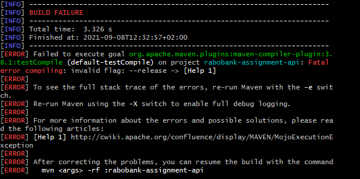
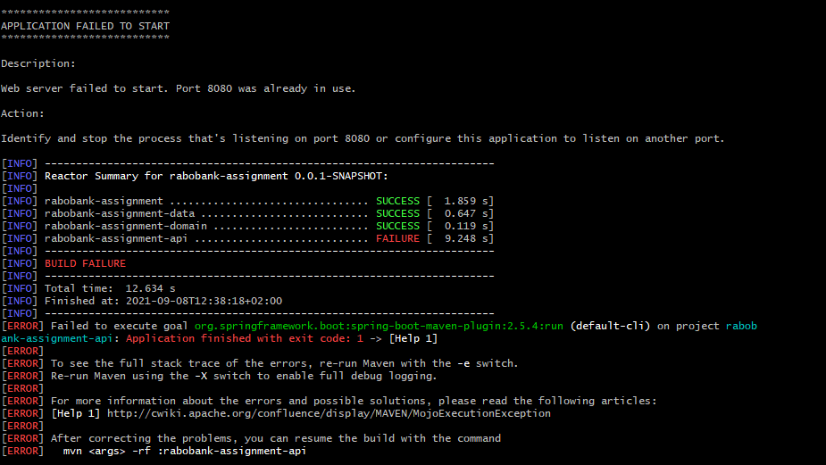
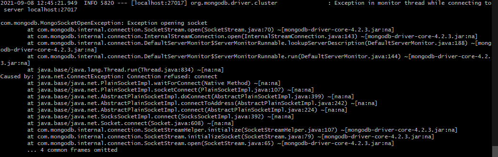

## Troubleshooting Guide to help with issues in local build

1. If you get this error when running maven commands. 

   Recommended Solution : Please ensure that your JAVA_HOME is pointing to jdk 9+.
   
2. If you get below error for port already in use

   Recommended Solution : Please make sure to free up 8080 port on your machine. There are different ways of doing this depending on your OS.
   
3. If you get issue when connecting to MongoDB 

   Recommended Solution : Please check if local mongoDB server is up. You can start the mongoDB server using below mentioned command.
   mongod